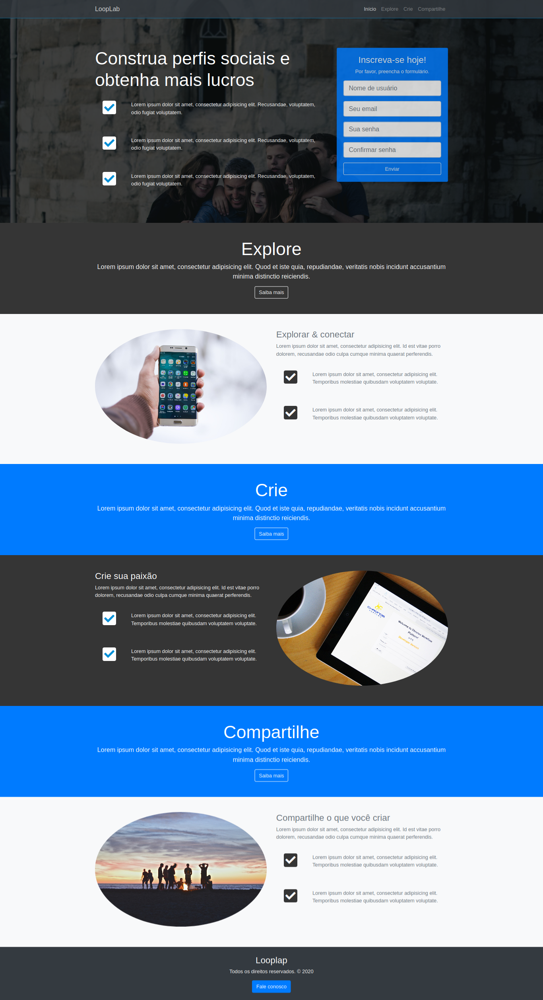

# looplap-landing-page

# new-year-countdown

## Project

***EN:*** This project is like a social media subscription landing page built during the Bootstrap 4 From Scratch With 5 Projects course taught by Brad Traversy.

***PT-BR:*** Esse projeto é como uma página inicial de inscrição de mídia social criada durante o curso Bootstrap 4 From Scratch With 5 Projects, ministrado por Brad Traversy.

## Specifications
- Create landing page with HTML/Bootstrap and some Pure CSS
- Add contact button at footer that launch a contact modal
- Insert scrollspy with smooth scroll behavior
***

## Technologies

This project was developed with the following technologies:

- HTML
- CSS
- Bootstrap
- JQuery
***
 
## Preview

***

## License

This project is under the MIT license.
